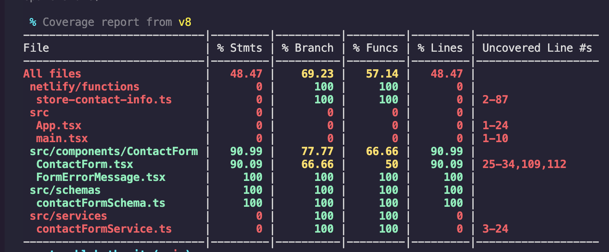

# Storyblok Contact Form App

<div align="center">
  
</div>

A full-stack React + TypeScript application for submitting contact requests, featuring real-time validation, backend storage via Netlify Functions and Firebase, and a modern, accessible UI.

[Giuliano De Ianni](mailto:giulianodeioannigcp@gmail.com)

### [Click here to see the Video Review](#)

## Proposed Solution

This project implements a robust contact form with the following features:

- **Frontend:**
  - Built with React, TypeScript, and Vite for fast development and HMR.
  - Uses `react-hook-form` and `yup` for form state management and validation.
  - Responsive, accessible UI styled with SCSS modules.
  - Displays real-time validation errors and submission feedback.
- **Backend:**
  - Netlify Function (`store-contact-info`) handles form submissions securely.
  - Stores contact requests in Firebase Realtime Database.
  - Validates required fields and handles errors gracefully.
- **Testing & Quality:**
  - Unit tests with Vitest and Testing Library.
  - E2E tests with Playwright.
  - Linting and formatting enforced via ESLint and Husky hooks.

#### Implementation Steps
- Set up project with Vite, React, TypeScript, and Bun.
- Designed and implemented a fully validated contact form using `react-hook-form` and `yup`.
- Created a Netlify Function to securely store form data in Firebase.
- Wrote unit tests for form logic and E2E tests for user flows.
- Configured CI scripts for linting, testing, and coverage.
- Documented setup, assumptions, and future improvements.

### [Click here to see the Live Demo](#)

## Screenshots

<div align="center">


</div>

## Assumptions
- Firebase credentials and database URL are securely provided via environment variables.
- The Netlify Function is properly configured and deployed for backend operations.
- The app is intended for demonstration and can be extended for production use.

## Libraries / Tools Used
- React.js
- TypeScript
- Vite
- Bun (package manager)
- react-hook-form
- yup
- SCSS Modules
- Netlify Functions
- Firebase Admin SDK
- Vitest, Testing Library, Playwright
- ESLint, Husky

## Setup

To install the dependencies, run:

```sh
bun install
```

To run the app locally:

```sh
bun run dev
```

## Firebase Configuration

To enable backend storage of contact form submissions, you need to set up Firebase and provide credentials via environment variables.

1. **Create a Firebase project** at [Firebase Console](https://console.firebase.google.com/).
2. **Generate a service account key** (JSON) with access to the Realtime Database.
3. **Set the following environment variables** in your `.env` file (see `.env.example` for reference):

   - `FIREBASE_SERVICE_ACCOUNT_KEY` — The full JSON string of your service account key (stringified).
   - `FIREBASE_DATABASE_URL` — The URL of your Firebase Realtime Database (e.g. `https://your-project-id.firebaseio.com`).

Example `.env` file:
```env
FIREBASE_SERVICE_ACCOUNT_KEY='{"type":"service_account",...}'
FIREBASE_DATABASE_URL=https://your-project-id.firebaseio.com
```

**Note:** Never commit your real `.env` file or credentials to version control. Use `.env.example` to document required variables for collaborators.

## Netlify Function & Deployment

This project uses a Netlify Function to securely handle contact form submissions and store them in Firebase. Here’s how it’s set up:

### Function Creation
- The main serverless function is located at `netlify/functions/store-contact-info.ts`.
- It receives POST requests from the frontend, validates the payload, and writes submissions to Firebase Realtime Database.
- The function uses the Firebase Admin SDK and expects credentials via environment variables.

### Netlify Directory Structure
- All Netlify functions are placed under the `netlify/functions/` directory.
- This keeps backend logic separate from frontend code and allows for easy scaling with additional functions.

### Netlify Configuration (`netlify.toml`)
- The `netlify.toml` file at the project root configures build settings and function directories:

```toml
[build]
  command   = "bun run build"
  publish   = "dist"
  functions = "netlify/functions"

[[redirects]]
  from = "/.netlify/functions/*"
  to = "/.netlify/functions/:splat"
  status = 200
```
- This ensures that API calls from the frontend to `/.netlify/functions/store-contact-info` are routed correctly.

### Local Testing
- You can test the Netlify Function locally using the Netlify CLI:
  ```sh
  netlify dev
  ```
- Ensure your `.env` variables are set before running locally.

### Deployment
- On push to the main branch (or via manual trigger), Netlify builds and deploys the app and functions.
- The deployed function is available at:
  ```
  https://<your-site>.netlify.app/.netlify/functions/store-contact-info
  ```

## Test results

<div align="center">

<table>
  <tr>
    <td align="center"><b>Coverage Report</b></td>
    <td align="center"><b>E2E Results</b></td>
  </tr>
  <tr>
    <td align="center"></td>
    <td align="center"></td>
  </tr>
</table>

</div>

## Running the tests

You can run the unit tests using:

```sh
bun run test
```

To run E2E tests:

```sh
bun run test:e2e
```

## Lighthouse Audit

<div align="center">


</div>


## Future Work

1. Achieve 90%+ test coverage (unit and E2E)
2. Improve styling and responsive design for all screen sizes
3. Add loading and error states for backend/network failures
4. Add admin dashboard to view submissions
5. Set up CI/CD for automated deployment and testing
6. Optimize performance and consider CDN for static assets

---

Feel free to reach out for questions or improvements!
